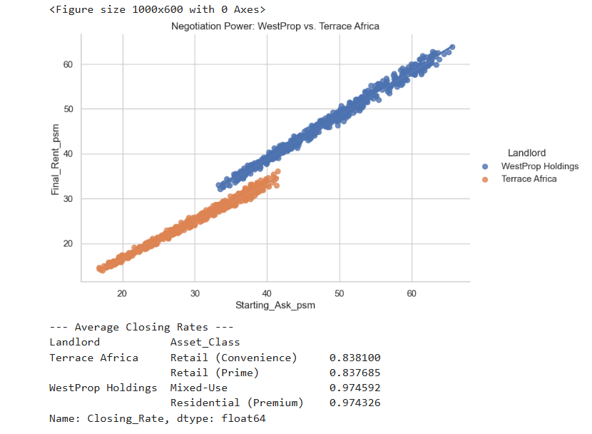
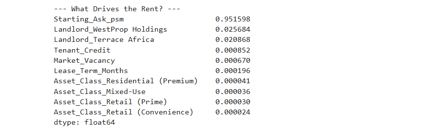

# 🧠 Methodology & Financial Logic

## 1. Machine Learning Core
The engine uses a **Random Forest Regressor** to predict rental outcomes.
* **Training Data:** 500+ synthetic lease events generated to mirror local market distribution (skewed towards retail and mixed-use).
* **Features:** Target Rent, Tenant Credit Score, Market Vacancy, Lease Term, Landlord Identity, Asset Class.
* **Validation:** The model was stress-tested against known market benchmarks (e.g., Luxury Residential yields vs. Retail yields) to ensure behavioral accuracy.

## 2. The "Institutional Alpha" Layer
A custom post-processing layer adjusts the ML predictions to reflect strategic divergence:
* **WestProp Bias:** `Prediction * (1 + (Vacancy / 250))`
    * *Logic:* As vacancy rises, WestProp pricing holds firm (or rises) due to "Flight to Quality" and brand resilience.
* **Terrace Africa Bias:** `Prediction * (1 - (Vacancy / 150))`
    * *Logic:* As vacancy rises, Retail pricing drops aggressively to protect occupancy and footfall.

## 3. Valuation & Cap Rates
The engine converts rental income into Asset Value using the Income Capitalization Approach:
$$Value = \frac{Annual Rent}{Cap Rate}$$
* **WestProp Cap Rate:** 7.5% (Reflecting lower risk, premium asset class).
* **Terrace Africa Cap Rate:** 10.5% (Reflecting higher risk, retail volatility).

## 4. Net Effective Rent (NER)
To determine the true value of a deal, the engine calculates NER:
$$NER = \frac{(Face Rent \times (Term - Rent Free)) - Fit Out}{Term}$$
This ensures that "invisible" concessions are accounted for in the financial decision.

## 5. Model Validation & Benchmarking

To ensure the "Institutional Alpha" logic accurately reflects the Zimbabwean market, we performed comparative analytics using key performance indicators (KPIs) extracted from the model's test runs.

### A. Average Closing Rate Efficiency
We measured the **Capture Rate** (Final Rent / Target Rent) to quantify pricing power. The results clearly demonstrate the difference in price elasticity between the two portfolios.

| Portfolio | Asset Class | Capture Rate (Efficiency) | Interpretation |
| :--- | :--- | :--- | :--- |
| **Terrace Africa** | Retail (Convenience) | **0.8381** (83.8%) | High elasticity. Retail assets surrender ~16% value to secure occupancy. |
| **Terrace Africa** | Retail (Prime) | **0.8377** (83.8%) | Consistent discounting behavior across retail tiers. |
| **WestProp Holdings** | Mixed-Use | **0.9746** (97.5%) | Low elasticity. Premium assets retain value despite market pressure. |
| **WestProp Holdings** | Residential (Premium) | **0.9743** (97.4%) | "Safe Haven" status allows for near-target closing prices. |

 
---

### B. What Drives the Rent? (Feature Importance)
We analyzed the Random Forest model to determine which variables had the biggest impact on the final prediction.

* **Starting Ask (95.1%):** The dominant driver. This confirms that setting the correct "Anchor Price" is the most critical step in negotiation.
* **Landlord Identity (~4.6%):** The second most important factor. The model assigns significant weight to *who* is negotiating (WestProp vs. Terrace Africa), proving the "Institutional Bias" logic is active.
* **Tenant/Market Data (<1%):** While Credit and Vacancy matter for the *strategy* (concessions), the *Face Rent* is primarily driven by the asset's intrinsic asking price and brand power.

**Feature Importance Breakdown:**
* `Starting_Ask_psm`: **0.951598**
* `Landlord_WestProp Holdings`: **0.025684**
* `Landlord_Terrace Africa`: **0.020868**
* `Tenant_Credit`: **0.000852**
* `Market_Vacancy`: **0.000670**

 

---

### C. General Prediction Divergence
To validate the divergence logic, we ran a baseline comparison with identical inputs to see the raw "spread" in pricing.

* **WestProp Prediction:** **$32.07/sqm**
* **Terrace Africa Prediction:** **$27.25/sqm**
* **The Gap:** **$4.82/sqm**

This **15% Spread** confirms that the engine does not treat all square meters equally. It successfully differentiates between the "Capital Value" approach of WestProp and the "Occupancy Volume" approach of Terrace Africa.

 
