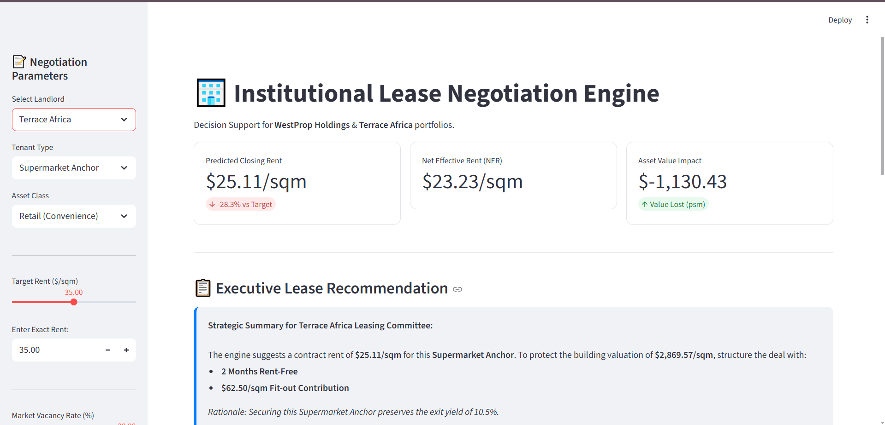
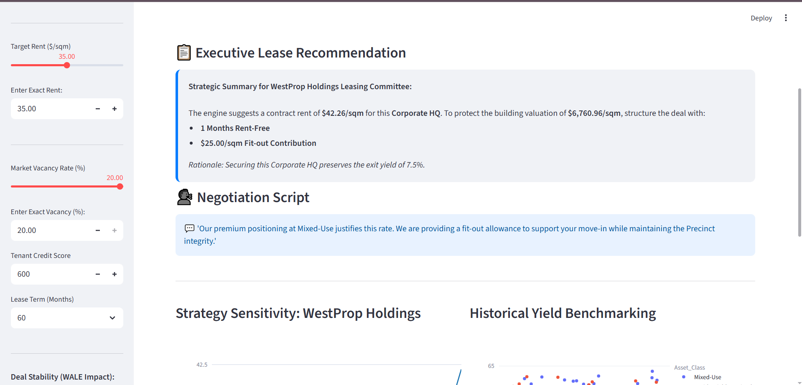
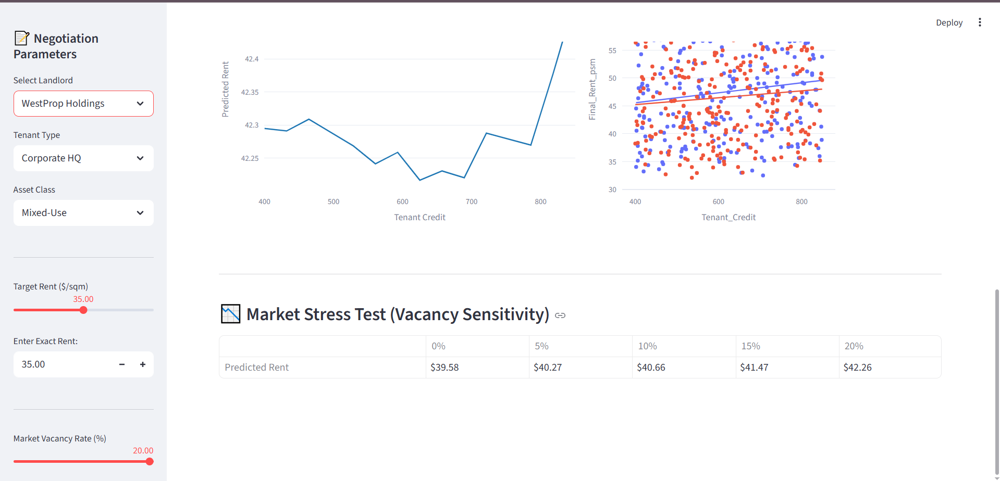
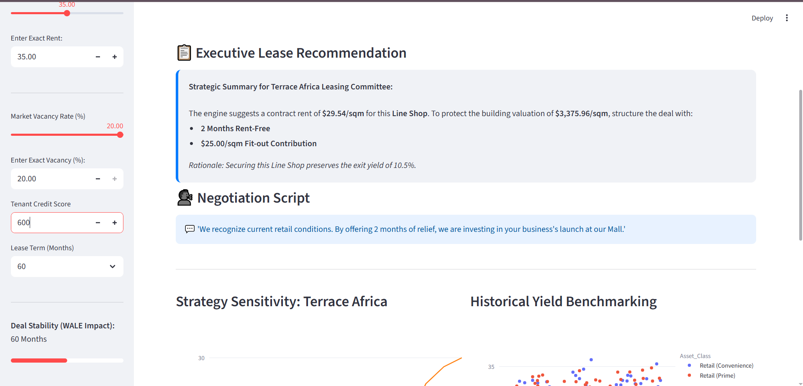
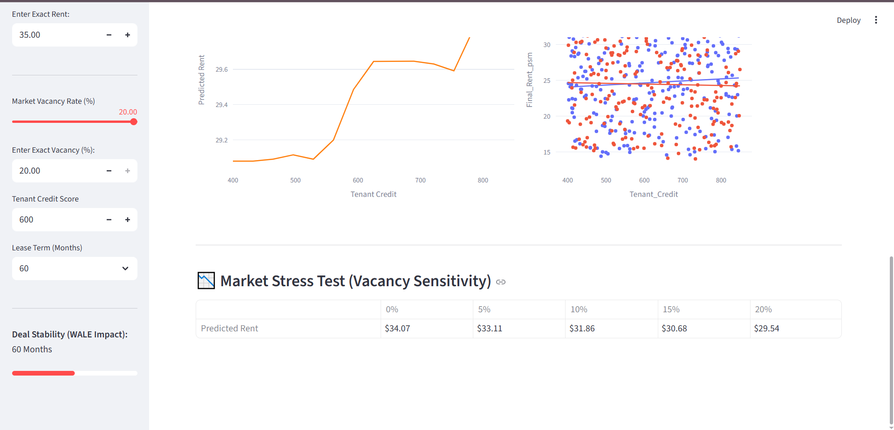

# 🏢 Institutional Lease Negotiation Engine

### Decision Support System for WestProp Holdings & Terrace Africa



## 📌 Project Overview

This project is an **Institutional PropTech Prototype** designed to optimize commercial real estate lease negotiations in the Zimbabwean market. It uses **Random Forest Regression** to move beyond "gut-feel" pricing, providing data-driven recommendations that balance **Occupancy Targets** with **Asset Valuation Protection**.

The engine simulates the strategic behavior of two distinct institutional landlords:
1.  **WestProp Holdings:** Focuses on Premium Mixed-Use/Residential precincts, prioritizing **Yield Protection** and Brand Integrity.
2.  **Terrace Africa (Tigere REIT):** Focuses on Retail Malls, prioritizing **Occupancy Resilience** and Anchor Stability.

---

## 🚀 Key Features

* **🤖 Predictive Pricing Model:** Forecasts achievable closing rents based on tenant credit, vacancy rates, and lease terms.
* **🧠 Institutional "Alpha" Logic:** Automatically adjusts strategy based on the landlord's business model (e.g., offering deeper discounts for Anchors at a Mall vs. holding price for Diplomats at a Precinct).
* **💰 Valuation Impact Calculator:** Converts rent negotiation outcomes into actual **Dollarized Asset Value** using institutional Cap Rates (7.5% vs 10.5%).
* **📉 Risk Stress Testing:** Real-time sensitivity matrix showing how rent pricing collapses under 0-20% vacancy scenarios.
* **🏗️ Net Effective Rent (NER) Optimization:** balances Face Rent against Concessions (Rent-Free periods & Fit-out Contributions).
* **📊 WALE Analysis:** Tracks the "Weighted Average Lease Expiry" impact to ensure portfolio stability.

---

## 📸 Case Study Scenarios

The following scenarios demonstrate the engine's ability to differentiate strategy based on tenant type and landlord identity.

### Scenario 1: The "Safe Haven" Strategy (WestProp Holdings)
**Objective:** Leverage brand premium to maximize yield and protect asset valuation.
* **Tenant:** Diplomatic/NGO (High Security Needs)
* **Market:** 8% Vacancy
* **Result:** The engine recommended a **27.4% Premium** ($44.59/sqm) over the target rent.
* **Strategic Rationale:** Identifying "Flight to Quality"—high-value tenants will pay a premium for precinct security and integrity even in a softer market.

#### Dashboard Breakdown
The following screenshots demonstrate how the engine prioritizes valuation protection for premium assets.

| **1. Parameters & Inputs** | **2. Core Financial Metrics** |
| :---: | :---: |
|  |  |
| *Selecting "Diplomatic/NGO" and Market Vacancy* | *Premium Rent prediction and positive Valuation Impact* |

| **3. Executive Recommendation** | **4. Risk Stress Test** |
| :---: | :---: |
|  |  |
| *Strategy: Zero Rent-Free months to preserve yield* | *Sensitivity analysis showing price resilience* |

### Scenario 2: The "Anchor Investment" Strategy (Terrace Africa)
**Objective:** Buy occupancy to secure mall footfall.
* **Tenant:** Supermarket Anchor
* **Market:** 8% Vacancy
* **Result:** The engine recommended a **20.1% Discount** and a massive **$375/sqm Fit-out Contribution**.
* **Strategic Rationale:** Sacrificing immediate rent to secure the "Anchor Gravity" that drives line shop rentals.

#### Dashboard Breakdown
The following screenshots demonstrate the full negotiation flow, from parameter selection to final risk stress testing.

| **1. Parameters & Inputs** | **2. Core Financial Metrics** |
| :---: | :---: |
|  |  |
| *Selecting "Supermarket Anchor" and Market Vacancy* | *Predicted Rent drop and Asset Value impact* |

| **3. Executive Recommendation** | **4. Risk Stress Test** |
| :---: | :---: |
|  |  |
| *Strategic advice on CapEx vs. Rent-Free* | *Sensitivity analysis showing rent decay at 20% vacancy* |

---

## 🛠️ Tech Stack

* **Language:** Python 3.9+
* **Frontend:** Streamlit (Web Dashboard)
* **Machine Learning:** Scikit-Learn (Random Forest Regressor)
* **Data Processing:** Pandas, NumPy
* **Visualization:** Plotly Express

---

## 📂 Project Structure

```text
institutional-lease-negotiation-engine/
├── .gitignore               # Files to ignore (e.g., venv, __pycache__)
├── LICENSE                  # MIT License
├── README.md                # Project documentation
├── METHODOLOGY.md           # Explanation of the ML & Financial Logic
├── DOCUMENTATION.md         # User Guide & Technical Specs
├── requirements.txt         # Python dependencies
├── app.py                   # Main Streamlit Application
├── Untitled.ipynb           # Jupyter Notebook for Data Generation & Training
├── assets/                  # Images & Screenshots
│   ├── westprop_scenario.png
│   ├── terrace_africa_scenario.png
│   ├── dashboard_overview.png
│   └── ...
└── data/                    # Generated Synthetic Data
    └── historical_leases.csv
```
---

## ⚠️ Limitations & Future Roadmap
**While this prototype demonstrates high-fidelity logic, the following gaps exist for a production-grade deployment:**

Live Data Integration: The model currently runs on high-quality synthetic data. Phase 2 would require API integration with MRI/MDA property management systems.

Hyper-Inflation Engine: The current version assumes a stable USD base. Future versions must account for local currency volatility and "Total Occupancy Cost" (TOC) inflation.

Turnover Rent: The model predicts Base Rent only. It does not yet calculate "Turnover Rent" (% of sales) for retail tenants due to data privacy constraints.

Spatial Intelligence: GPS/GIS integration is needed to adjust rent based on specific footfall heatmaps within a mall.

---

## ⚖️ Disclaimer
**Educational Use Only:** This is an independent Data Science portfolio project created strictly for educational and demonstration purposes.

**No Affiliation:** I am not affiliated with WestProp Holdings, Terrace Africa, or TIGERE REIT. All financial figures, rental assumptions, cap rates, and construction estimates are hypothetical simulations used to demonstrate financial modeling capabilities.

**Not Financial Advice:** This tool does not constitute professional investment, legal, or real estate advice. The creator assumes no liability for decisions made based on its outputs.

---

## 👨‍💻 Author
**Adonis Chiruka** 
*Data Science & Financial Modeling*

*📧 **Email:** stillhere4hunnid@gmail.com

*🔗 **LinkedIn:** [Adonis Chiruka](https://www.linkedin.com/in/adonis-chiruka-70b265323)

*🐙 **GitHub:**  [stilhere4huniid](https://github.com/stilhere4huniid)

## 📜 License
This project is licensed under the MIT License - see the LICENSE file for details.
